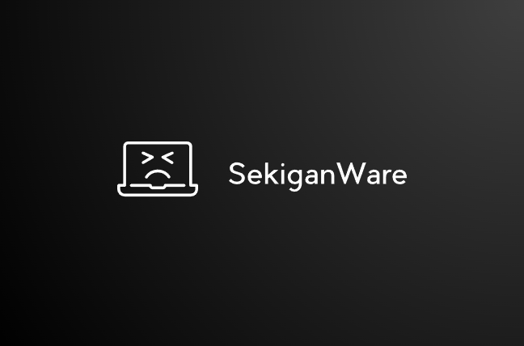
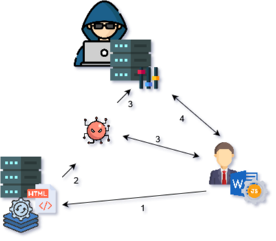

<div id="top"></div>

<!-- PROJECT LOGO -->
<br />
<div align="center">
  <a href="https://github.com/cryxnet/sekiganware">
    
  </a>

<h3 align="center">SekiganWare</h3>

  <p align="center">
   A Malware that uses a CVE-2022-30190 Payload
    <br />
    <a href="https://github.com/cryxnet/sekiganware"><strong>Explore the docs »</strong></a>
    <br />
    <br />
    <a href="https://github.com/cryxnet/sekiganware">View Demo</a>
    ·
    <a href="https://github.com/cryxnet/sekiganware/issues">Report Bug</a>
    ·
    <a href="https://github.com/cryxnet/sekiganware/issues">Request Feature</a>
  </p>
</div>

# Proof of Concept of the original SekiganWare Malware, source code not avaliable anymore...

<!-- TABLE OF CONTENTS -->
  <h2> Table of Contents </h2>
  <ol>
    <li><a href="#disclaimer">**DISCLAIMER**</a></li>
    <li><a href="#about-the-project">About The Project</a></li>
    <li><a href="#getting-started">Getting Started</a></li>
    <li><a href="#usage">Usage</a></li>
    <li><a href="#technical-documentation">Technical Documentation</a></li>
    <li><a href="#social-engineering-vector">Social Engineering Vector</a></li>
    <li><a href="#contributing">Contributing</a></li>
    <li><a href="#license">License</a></li>
    <li><a href="#acknowledgments">Acknowledgments</a></li>
  </ol>

## Information about Follina (CVE-2022-30190)

This Zero-Day Exploit got fixed and the attack vector isnt available anymore.
Its possible when you downgrade Word to the vulnerable version.

<!-- ABOUT THE PROJECT -->

## About The Project

SekiganWare is a Malware that uses the Follina attack vector. With help of social engineering, it is possible to compromise whole networks and computers within seconds. The Malware is not detectable from many Antivirus.
The Human is the most vulnerable target. With help of social engineering and psychological thinking, it is possible to gain easy access to sensitive information and control. It's more dangerous when there's a 0-Day Exploit in a program that most people using it in their everyday use.
This Project should show people how computers get compromised with social engineering attacks, how malware even works, and the important thing; how to protect yourself from attacks.

<p align="right">(<a href="#top">back to top</a>)</p>

### Built With

- [Python](https://python.org)

<p align="right">(<a href="#top">back to top</a>)</p>

<!-- GETTING STARTED -->

## Getting Started

### Prerequisites

Python 3.9.x needed. (You need to install that into a venv)

```sh
pip install socket
pip install os
pip install threading
pip install pyfiglet
pip install colorama
pip install time
pip install pyinstaller
```

<p align="right">(<a href="#top">back to top</a>)</p>

<!-- USAGE EXAMPLES -->

## Usage

1. Install the needed libs with pip
2. Create a VENV using `python -m venv venv`
3. Activate the VENV
4. Install the required "malware" libs using `pip install -r requirements.txt`
5. Build the exe with the build tool `build-sekigan.bat`
6. Go to `src/payload` and change the host, port var and the url for the located malware (exe) in the follina.generator.py file and also in the sekiganware.payload.bat file
7. Generate and the Payload using `python follina.generator.py`
8. Start the "Hacker" server using `python src\master\main.py`
9. Now send the created word file to your victim
10. Finished ;D

<p align="right">(<a href="#top">back to top</a>)</p>

<!-- Tech Docs -->

## Technical Documentation

### About CVE-2022-30190

[A YouTube Video from John Hammond explaining this exploit in details](https://www.youtube.com/watch?v=dGCOhORNKRk&t=718s)

[Mitre CVE-2022-30190](https://cve.mitre.org/cgi-bin/cvename.cgi?name=CVE-2022-30190)

[Microsoft Security Response Center](https://msrc-blog.microsoft.com/2022/05/30/guidance-for-cve-2022-30190-microsoft-support-diagnostic-tool-vulnerability/)

### Attack Strategy



1. The victim recveives the infected Word file that executes javascript code that downloads and executes a batch file
2. The batch file is downloading a windows package manager named _Chocolaty_ to download all prerequisites.
3. After everything is ready, the malware gets loaded into the system and executes
4. Now the hacker got a reverse TCP connection to the victim where the hacker can do remote code execution and use exploits.

The hacker has 2 servers that are up. The one is the server to control the malware (send commands) and the other server got the payloads and other stuff like this.

### Malware Functions

| Name                             | Description                                                         |
| -------------------------------- | ------------------------------------------------------------------- |
| help                             | shows help                                                          |
| cmd (command)                    | Command Injection                                                   |
| reverseshell (ip) (port)         | Reverse Shell Connection                                            |
| webcamshot                       | Creates a picture from the webcam                                   |
| spoofing (host) (target) (count) | Spoofes IPs                                                         |
| googlepwd                        | extracts all google chrome saved passwords                          |
| scan (type) (target)             | execute different nmap scans [machine, network, vuln] on the target |
| sniffing (count)                 | sniff packages from the network (you will get a pcap file)          |
| locate                           | get current location from the machine                               |
| wifiextractor                    | get router information and passwords                                |
| ransomeware                      | A ransomeware that destroys the machine with good music             |
| shutdown                         | force shutdowns the machine                                         |
| restart                          | restarts the machine                                                |
| logout                           | logouts the current user                                            |

## Social Engineering Vector

### What is Social Engineering

> Social engineering (political science), a means of influencing particular attitudes and social behaviors on a large scale. Social engineering (security), obtaining confidential information by $pulating and/or deceiving people and artificial intelligence. - [Wikipedia](<https://en.wikipedia.org/wiki/Social_engineering#:~:text=Social%20engineering%20(political%20science)%2C,deceiving%20people%20and%20artificial%20intelligence>)

Simply put, it is psychological manipulation of a person to cause a certain behavior.

### Social Engineering Attack

If you want to execute a hack successfully, you need to find out, collect and evaluate information about your target. You do this with the help of OSINT (Open Source Intelligence). Next, you take this information and prepare a so-called `pretext`. Next, you plan what kind of attack you are going to make and what you are going to target. Only then do you execute everything. You should always have a plan first. This should serve as a so-called red line in case you lose track.

### Social Engineering Attack Example

#### Information

1. it is a small company that is in a village.
2. they have 12 employees in total.
3. 4 of them work in the finance department and manage the finances.
4. the company is going down because of inflation and lack of customers.
5. on the website is the email address of the person who does the accounting.
6. the building is rented from a small real estate agent.
7. the company has just rented the office.
8. the costs are very high for a new company.

#### Pretext

> Good day Mr./Mrs. Thank you for asking us for an office. We hope you and the employees are satisfied with the facility and location. We have created a digital document with the recorded agreements. It also states how the costs are calculated and other information relevant to owners of this office. Depending on that, we can scale the prices down. We do not want you to go bankrupt because of us. There is a lot going on right now with all the inflation, etc. Please look at the document carefully (how costs are calculated etc.) and email me for a proposal. We look forward to working with you. Kind regards "real estate agent company name".

This pretext is about the agent being able to lower the cost of the rent according to his wishes and suggestions. We have found out that the company is currently in the red due to lack of customers. We associate the lack of customers with the current inflation. The employee unconsciously perceives this and classifies it as _correct_. Finally, it is mentioned again that he should read the document with care and write an email as needed. Writing an email triggers again that he should look at the document as soon as possible. Also because of curiosity he will look at the document immediately. As you can also read, there are _friendly texts_ at the beginning and at the end that should increase the sympathy. In addition, it is also said that the agent will be pleased with the cooperation. This leads to the fact that the probability that the employee writes an email is higher. What again also leads to the fact that the employee opens the Word file. Finally, the employee unconsciously absorbs every word. Also the sentence structure makes a big difference. If you also noticed, we wrote "Thank you for asking us for an office" at the very beginning. This should unconsciously increase trust.

#### Attack Plan

You buy a domain that has the almost identical name of the real estate company. Then you create an email server based on the domain with which you create an email address. After that you send an email to the target.
In the email, you have an infected Word file with the configured Follina exploit attached. As soon as the user opens it, the attack mentioned above is executed. The hacker has now gained access to the computer.

### Moral View

Social engineering is about leading a person to perform certain actions. This can be, as already mentioned above, sensitive information and much more. Social engineering is about finding "weak points" in a person. To do this, you must first find out what the person likes, but also what the person hates. Social engineering exploits such things to manipulate the person. Social engineering takes advantage of gender, age, status of a person, the personality, appearance, intelligence and much more. Therefore, in this respect, social engineering is politically and morally incorrect. Depending on what the hacker wants exactly, it could become very brazen, which could even weaken a person's psyche and generally make the person mentally ill. Social engineering is the most used vulnerability. Fortunately, it is not so bad that it quickly becomes morally incorrect. Nevertheless, social engineering remains one of the most brazen hacking methods.
If you want to learn more about social engineering, or if you want to delve deeper, I recommend the book 'Social Engineering: The Science of Human Hacking' by Christopher Hadnagy.

**Hacking is like magic. You just have to manipulate the reality of someone for your benefits.**

## AV RESULT

(👻) = Undetected
(🛑) = Detected
(⭐) = Most Used
(💽) = OS

- Most of them can get bypassed by using a signature and/or unreadable code.
- Scan made with only the EXE file and no manipulations.

| VENDOR                             | RESULT                                |
| ---------------------------------- | ------------------------------------- |
| (⭐) Avira (no cloud)              | (🛑) HEUR/AGEN.1242735                |
| (⭐) Kaspersky                     | (🛑) HEUR:Trojan-PSW.Python.Agent.gen |
| F-Secure                           | (🛑) Heuristic.HEUR/AGEN.1242735      |
| ZoneAlarm by Check Point           | (🛑) HEUR:Trojan-PSW.Python.Agent.gen |
| ESET-NOD32 (host) (target) (count) | (🛑) Python/PSW.Agent.LU              |
| Jiangmin                           | (🛑) Trojan.Generic.hhkmb             |
| Zillya                             | (🛑) Trojan.Agent.Script.1713931      |
| (⭐) McAfee                        | (👻) Undetected                       |
| (⭐) Microsoft (💽)                | (👻) Undetected                       |
| (⭐) Avast                         | (👻) Undetected                       |
| (⭐) McAfee-GW-Edition             | (👻) Undetected                       |
| Ad-Aware                           | (👻) Undetected                       |
| Alibaba                            | (👻) Undetected                       |
| Arcabit                            | (👻) Undetected                       |
| Baidu                              | (👻) Undetected                       |
| BitDefenderTheta                   | (👻) Undetected                       |
| CrowdStrike Falcon                 | (👻) Undetected                       |
| Cyren                              | (👻) Undetected                       |
| Emsisoft                           | (👻) Undetected                       |
| Fortinet                           | (👻) Undetected                       |
| Gridinsoft                         | (👻) Undetected                       |
| K7AntiVirus                        | (👻) Undetected                       |
| Kingsoft                           | (👻) Undetected                       |
| Malwarebytes                       | (👻) Undetected                       |
| MaxSecure                          | (👻) Undetected                       |
| NANO-Antivirus                     | (👻) Undetected                       |
| Panda                              | (👻) Undetected                       |
| SentinelOne (Static ML)            | (👻) Undetected                       |
| SUPERAntiSpyware                   | (👻) Undetected                       |
| TACHYON                            | (👻) Undetected                       |
| Tencent                            | (👻) Undetected                       |
| Trellix (FireEye)                  | (👻) Undetected                       |
| TrendMicro-HouseCall               | (👻) Undetected                       |
| VIPRE                              | (👻) Undetected                       |
| ViRobot                            | (👻) Undetected                       |
| Yandex                             | (👻) Undetected                       |
| Acronis (Static ML)                | (👻) Undetected                       |
| AhnLab-V3                          | (👻) Undetected                       |
| ALYac                              | (👻) Undetected                       |
| BitDefender                        | (👻) Undetected                       |
| Bkav Pro                           | (👻) Undetected                       |
| Comodo                             | (👻) Undetected                       |
| Cybereason                         | (👻) Undetected                       |
| DrWeb                              | (👻) Undetected                       |
| eScan                              | (👻) Undetected                       |
| GData                              | (👻) Undetected                       |
| Ikarus                             | (👻) Undetected                       |
| K7GW                               | (👻) Undetected                       |
| Lionic                             | (👻) Undetected                       |
| MAX                                | (👻) Undetected                       |
| Palo Alto Networks                 | (👻) Undetected                       |
| QuickHeal                          | (👻) Undetected                       |
| Symantec                           | (👻) Undetected                       |
| TEHTRIS                            | (👻) Undetected                       |
| Trapmine                           | (👻) Undetected                       |
| TrendMicro                         | (👻) Undetected                       |
| VBA32                              | (👻) Undetected                       |
| VirIT                              | (👻) Undetected                       |
| Webroot                            | (👻) Undetected                       |
| Zoner                              | (👻) Undetected                       |
| Sophos                             | (👻) Undetected                       |

## Conclusion

It was interesting to see exactly how everything works. Developing your own hacking strategy and mechanism was also very interesting and fun. I also realized what a big role social engineering can play.

## Contributing

Contributions are what make the open source community such an amazing place to learn, inspire, and create. Any contributions you make are **greatly appreciated**.

If you have a suggestion that would make this better, please fork the repo and create a pull request. You can also simply open an issue with the tag "enhancement".
Don't forget to give the project a star! Thanks again!

1. Fork the Project
2. Create your Feature Branch (`git checkout -b feature/AmazingFeature`)
3. Commit your Changes (`git commit -m 'Add some AmazingFeature'`)
4. Push to the Branch (`git push origin feature/AmazingFeature`)
5. Open a Pull Request

<p align="right">(<a href="#top">back to top</a>)</p>

<!-- LICENSE -->

## License

Distributed under the Apache 2.0 License. See [`LICENSE`](/LICENSE) for more information.

<p align="right">(<a href="#top">back to top</a>)</p>

<!-- ACKNOWLEDGMENTS -->

## Acknowledgments

Big thanks to John Hammond for creating a codebase to generate the follina payload (CVE-2022-30190).

- [John Hammond](https://github.com/JohnHammond)

<p align="right">(<a href="#top">back to top</a>)</p>

## Disclaimer

**YOUR USAGE OF THIS PROJECT CONSTITUTES YOUR AGREEMENT TO THE FOLLOWING TERMS:**

- THE MISUSE OF THE DATA PROVIDED BY THIS PROJECT AND ITS MALWARES MAY LEAD TO CRIMINAL CHARGES AGAINST THE PERSONS CONCERNED.

- I DO NOT TAKE ANY RESPONSIBILITY FOR THE CASE. USE THIS PROJECT ONLY FOR RESEARCH PURPOSES, EDUCATIONAL PURPOSES & ETHICAL ONLY.

- SekiganWare is a project related to Computer Security and for Educational Purposes and not a project that promotes illegal activities.

- Don't use this Project for any illegal activities.

- If something happens, we do not take any liability.

- SekiganWare should be considered as a project for educational purposes.

- It should teach people how a Malware and a complex Hack Strategie could work and also how to deal with those threats.
